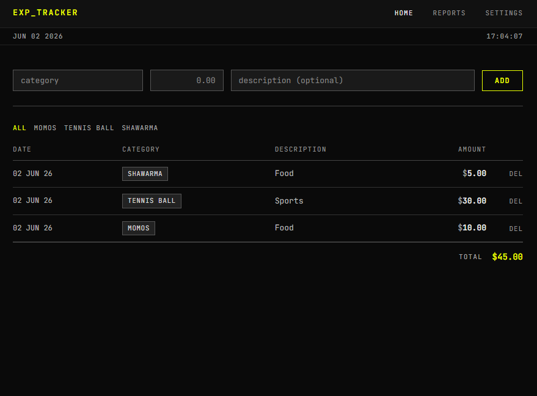
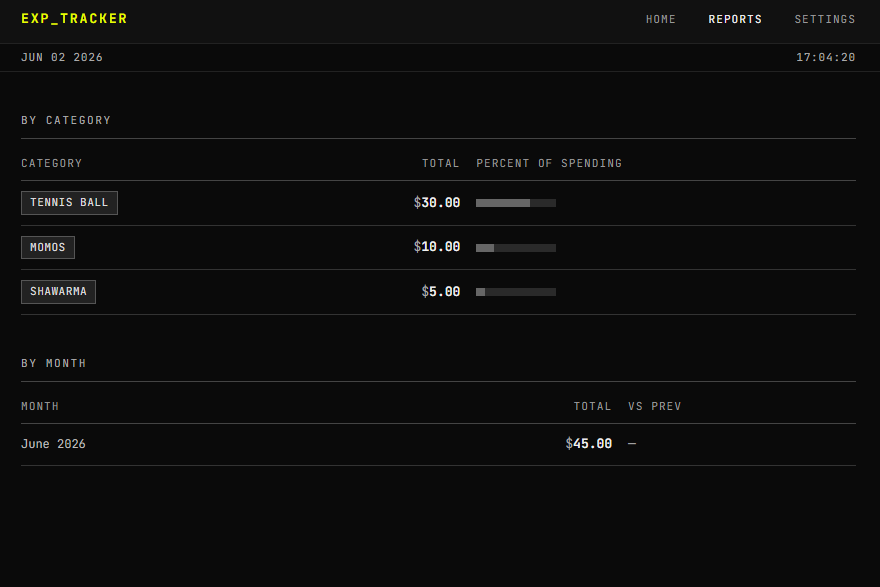
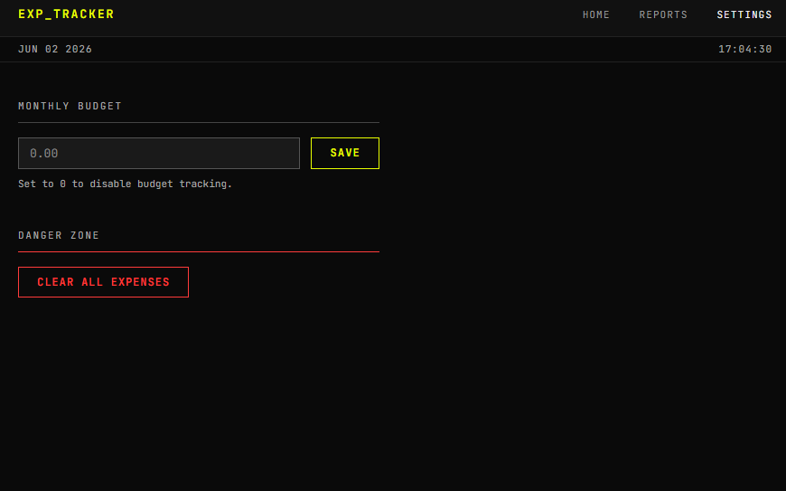

# Expense Tracker

This started as a side project in my first year of BE Computer Science at Jyothy Institute of Technology, VTU. I wanted something simple to track where my money was going each month, so I built it.

## Screenshots


*Home page with expense list, category filter, and running total*


*Reports page showing spending by category and by month*


*Settings page with monthly budget configuration*

## Features

- Add and delete expenses by category
- Monthly budget tracking with a progress bar (green under 80%, amber at 80-99%, red when over)
- Category and monthly spending reports
- Category filter on the home page
- Input validation on all form submissions

## Tech Stack

| Technology | Purpose |
| --- | --- |
| Python | Language |
| Flask | Web framework |
| SQLAlchemy | ORM and database access |
| SQLite | Database |
| pandas | Report aggregation |

## Setup

```bash
git clone https://github.com/achalnm/Expense-Tracker-Using-Flask-and-SQLAlchemy.git
cd Expense-Tracker-Using-Flask-and-SQLAlchemy
python -m venv venv
# On Windows:
venv\Scripts\activate
# On macOS/Linux:
source venv/bin/activate
pip install -r requirements.txt
flask run
```

Open `http://127.0.0.1:5000` in your browser. The database is created automatically on first run.

## Running Tests

```bash
python tests.py
```

## Project Notes

This was originally a quick personal tool for tracking daily expenses. It was later cleaned up with proper input validation, budget tracking, a reporting page, and tests as a learning exercise in Flask and SQLAlchemy.
